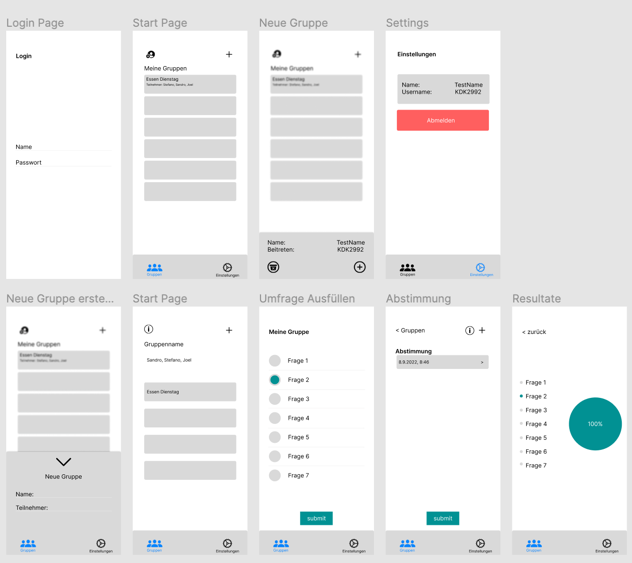
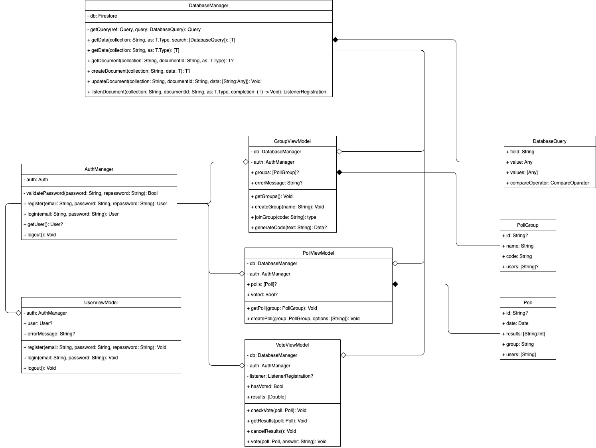
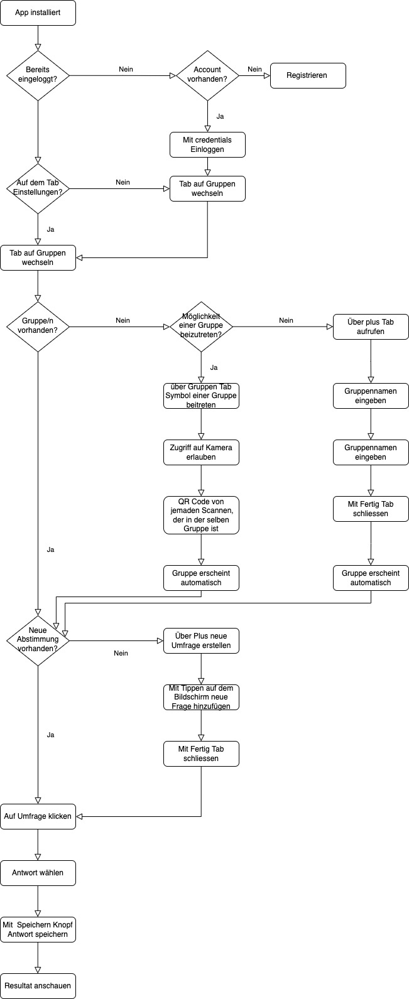

# Konzept App

## Sinn der App

Der Sinn dieser App ist es, Abstimmungen in Gruppen zu vereinfachen, Sei es die Frage „Was wollen wir heute Essen?“, oder „Was wollen wir am Wochenende unternehmen?“, die App soll es so einfach wie möglich machen in einer Gruppe Entscheidungen zu treffen.

## Zielgruppe

Die App kann schlussendlich von jedem benutzt werden, richtet sich jedoch hauptsächlich an jüngere Leute.

## Anforderungen

Die App soll übersichtlich sein, so dass jeder weiss wie sie funktioniert.

## Mockups

## Funktionen der App

Man kann Gruppen erstellen oder bereits erstellten Gruppen beitreten. In jeder Gruppe ist man dann in der Lage eine Umfrage zu erstellen. Jeder in der Gruppe bekommt dann eine Benachrichtigung in der man dazu aufgefordert wird die Umfrage auszufüllen. Jeder sieht dann das Ergebnis in Echtzeit.

## Architektur

Wir verwenden MVVM. Der Grund dafür ist, das Swift und SwiftUI auf dieser Architektur aufgebaut sind und man sehr gut damit Arbeiten kann.

**MVVM** bedeutet Model-View-ViewModel.

- Das **Model** definiert die Struktur der Daten
- Die **View** beschreibt die Darstellung und das UI.
- Und das**ViewModel** beinhaltet die Logik und Funktionalität und verknüpft somit Model und View

## Verwendete Technologien

Die App wird in **Swift** geschrieben, mit dem dazugehörigen UI Framework **SwiftUI**. Als Entwicklungsumgebung wird daher Xcode verwendet.
Um die Daten abzuspeichern, beziehungsweise später wieder abzurufen, integrieren wir Firebase Firestore win die App.

## Diagramme

### UML

### Flowchart

## Testkonzept

| Funktion                    | Beschreibung                                                                                                        | Vorraussetzung                                                                                          |
| --------------------------- | ------------------------------------------------------------------------------------------------------------------- | ------------------------------------------------------------------------------------------------------- |
| Registrieren                | Wenn man noch nicht eingeloggt ist, soll man sich mit Mail und Passwort registrieren können                         |                                                                                                         |
| Einloggen                   | Wenn man bereits einen Account hat, soll man sich mit diesen Credentials anmelden können.                           | Account muss vorhanden sein. Tab: Login                                                                 |
| Gruppe erstellen            | Über den Plus Button soll man eine Gruppe erstellen und benennen können.                                            | Man muss eingeloggt sein. Tab: Gruppen                                                                  |
| Gruppe beitreten            | Um einer Gruppe beitreten zu können muss man über das Gruppen Symbol mit der Kamera ein QR Code scannen können.     | Mann muss eingeloggt sein und jemand anderes muss eine Gruppe erstellt haben. Tab: Gruppen              |
| Umfrage erstellen           | Eine Umfrage soll mit beliebig vielen Fragen über den Plus Butten erstellt werden können.                           | Man muss eingeloggt sein, in einer Gruppe sein. Tab: Gruppen->Gruppe                                    |
| Umfrage ausfüllen           | Die Umfrage soll ausgefüllt werden per Klick auf der Frage.                                                         | Man muss eingeloggt sein und eine neue Umfrage muss erstellt worden sein. Tab: Gruppen->Gruppe->Umfrage |
| Umfrage Ergebnisse anzeigen | Die Ergebnisse sollen angezeigt werden, sobald die Umfrage ausgefüllt wurde.                                        | Man muss eingeloggt sein, und eine Umfrage muss ausgefüllt worden sein. Tab: Gruppen->Gruppe->Umfrage   |
| QR Code generieren          | Der QR Code soll generiert werden sobald man in der entsprechenden Gruppe auf das Info Zeichen drückt.              | Man muss eingeloggt sein, und in einer Gruppe sein. Tab: Gruppen->Gruppe->Info                          |
| Ausloggen                   | Wenn man auf den Ausloggen Button drückt, soll man ausgeloggt werden und auf die Login Seite weitergeleitet werden. | Man muss eingeloggt sein. Tab: Einstellungen                                                            |
